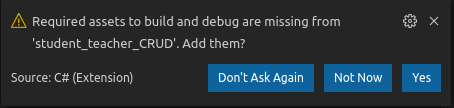

#Workshop .NET

##1. Installation

1 . This readme assumes that you have git installed (check with "git --version" in terminal), that you have MySQL installed and that you can work with a database manager like DBeaver. 
If you don't have MySQL, you need to install the SQLite package.

2 . Go to https://dotnet.microsoft.com/download and click "Install .NET Core" (Linux) or "Download .NET Core" (MacOS/Windows)

3 . Follow the steps for your OS, for Linux:
- first add the Microsoft package signing key to your list of trusted keys and add the package repository
- then install the .NET Core SDK (the SDK includes the runtime already)
- **IMPORTANT**: for the last command, specify the exact version of the SDK, in our experience, 
the newest version resulted in a bug when using one of the tools we'll be installing later. If your version is not 3.1.301 (`dotnet --info`), you can still continue and try for yourself if it works and install the working SDK later. Your last command should look something like this:

`sudo apt-get install -y dotnet-sdk-3.1=3.1.301-1` 

4 . Optional (but recommended): install Jetbrains Rider. 
(Ubuntu: `sudo snap install rider --classic`)

If you do use Visual Studio Code, make sure to click yes when this window pops up on a new dotnet project: 




##2. Introduction to C# and .NET: Console Calculator

1. Make a folder for your calculator files, cd to it and run the command "dotnet new console". Open the folder with your text editor of choice. 
Alternatively, if you did choose to use Rider, you can create a project with the Rider's and select Console application in the menu.
2. One of your files is the Program.cs file, which contains a Program class and a Main method. It is this method that will
be triggered by the runtime, so this is where your code should start. For this initiation, however, you can just write the entire logic inside of the Program class.
3. Once you have written your logic (cf. workflow below), you can test your code by either typing `dotnet run` in your terminal or clicking the "Run" button in your editor.

**Workflow:** 
- Ask the user for two numbers and save them as variables 
(hint: use the built-in Console.WriteLine() en Console.ReadLine() methods). Remember: C# distinguishes between ints, floats and doubles.
- Next ask for the operation the user wants to do with those numbers. For instance, if he types "divide", then your function divides number one by number 2.
- Display the result in the console.

**Bonus:**

- Dividing by zero will give "infinite" as a result, handle that exception so your console tells you you can't divide by zero.
- Once your result is in, make it possible for the user to continue with another calculation. You can display a "Do you want to continue? y/n" message and wait for the user to press a key (hint: Console.ReadKey() may be a useful method here).

Congratulations! You just wrote your first C# and .NET application!


##3. Time for the real work: a CRUD website with Razor Pages

1 . Make a new folder where you want your files to go, cd into it and start a new .NET project. 

- Visual Studio Code: "dotnet new webapp" and open the folder with VS Code, click "Yes" when a message pops up to add required assets.


- Rider:

2 . A template application is automatically generated. This time our Main method in the Program.cs creates a web page. To check the auto-generated page, click the run or launch button, or use your terminal: "dotnet run" and follow the link. 
You should now see a warning message like this:

. 

Since we are in development mode on our localhost, there is no safety issue and we don't need to worry about the certificate, so click "advanced" and proceed to the localhost.


With just two simple steps, you have already generated a web page with .NET Razor Pages!

3 . Next we need to make classes (which are called models) that represent the database objects. If you know Symfony: it is quite similar to that.
- Make a folder "Models" where you can store your database classes.
- In that folder, make a "Teacher.cs" and a "Student.cs" file.
- Add the following code to your Teacher class: 
```
namespace YourApplicationName.Models
   {
       public class Teacher
       {
           //add properties of model here
       }
   }
``` 
- To add a property, just type "prop" and you should get an autocomplete option. 
Press enter and you should now have something like this: `public int MyProperty { get; set; }`.
Add ID, Last_Name, First_Name and Email properties and specify the correct types for them. You can add more properties if you like.
- Do the same thing for your Student class but also add a Teacher property. 
Typehint Teacher as being of the Teacher Type.
- Since your Teacher property is going to be the property that links your tables together, we have to add a data annotation above the property:

```
[ForeignKey("TeacherID")]
```
With this, we are basically telling the EntityFramework that we want our student to link to a teacher and that the database can find this teacher using the foreign key "TeacherID". This way the TeacherID column in our Student table will point to the normal ID in the Teacher table.
There are a lot more data annotations you can use, for instance if you want to make properties not nullable.

4 . Now it's time to add some extra packages and useful tools. Run the following commands:

```
    dotnet tool install --global dotnet-ef
    dotnet tool install --global dotnet-aspnet-codegenerator
    dotnet add package MySql.Data.EntityFrameworkCore
(OR dotnet add package Microsoft.EntityFrameworkCore.SQLite)
    dotnet add package Microsoft.VisualStudio.Web.CodeGeneration.Design
    dotnet add package Microsoft.EntityFrameworkCore.Design
    (dotnet add package Microsoft.EntityFrameworkCore.SqlServer)
    dotnet add package Microsoft.Extensions.Logging.Debug
```
The dotnet-ef tool adds the Entity Framework, which is an ORM meaning it allows you to convert C# Objects to database entries and back. Again, if you've worked with Symfony already,
 this should be familiar to you!

The codegenerator tool makes some useful commands available with which you can create your CRUD pages based on the models.

The SQL packages are .NET packages we need to add to a project when we need to connect to a database to store information.

5 . We still haven't created a class to work with our database yet. 
Create a new folder give it an appropiate name, like "Data", and create a new file.
By convention this file is named "YourAppName" + "Context.cs", so name it YourAppNameContext.cs.

Inside the file, specify that its contents are inside off the namespace "YourAppName.Data" (`namespace YourAppName.Data{}`).

Above the namespace specify that you want to use the recently added EntityFrameWork Core with `using Microsoft.EntityFrameworkCore;` .

6 . Inside this namespace we have to create our Context class, which extends the EntityFramework's DbContext class.

This is what that class should look like:
```
public class YourAppNameContext : DbContext
    {
        public YourAppNameContext (
            DbContextOptions<YourAppNameContext> options)
            : base(options)
        {
        }

        public DbSet<YourAppName.Models.Student> Student { get; set; }
        public DbSet<YourAppName.Models.Teacher> Teacher { get; set; }    
}
```
A short explanation of this code is in order...

Inside of our class' constructor method (`public YourAppNameContext`) we pass the options we will specify later. 
Notice that the body of the constructor is empty. 

The way we pass the options is by using `: base(options)`, which means we are passing the options to the constructor of the base class,
DbContext. 

Since our Context class extends this class, it will have an options property by default, because this property is inherited from the base DbContext class.

Lastly, we have two DbSet properties that correspond to the tables we want in our database, so one for Student and one for Teacher.


7 . We now have a class to connect to our database, but we still have to work on our "options" that we want to pass to this class.
One of the options our Context class needs is a connection string for our database.

We can add one or more connection strings in our appsettings.json file. 
```
"ConnectionStrings": {
    "StudentTeacherContext": "server=localhost;database=databaseName;user=userName;password=password;"
  }
```

It doesn't matter what you call your connection string, just remember where you can find the name (or remember it) for a next step.

Replace "databaseName" with whatever name you want your database to get, you don't have to create a database yet with MySQL! Then replace "userName" and "password" with your MySQL username and password.

8 . Now we should tell our code it should use the DbContext with as option the connection string we just created. For this we need to go into the Startup.cs file.

In this file, add two new using statements: 

```
using YourAppName.Data;
using Microsoft.EntityFrameworkCore;
```

Then in the ConfigureServices() method, we need to add a new service, so let's add 
```
services.AddDbContext<YourAppNameContext>(options =>
        options.UseMySQL(Configuration.GetConnectionString("StudentTeacherContext")));```
```
Here we basically add our class that deals with our database and tell the configuration it should look for the connection string we named earlier. If you forgot which name you gave your connection string, go check in appsettings.json.

If you want to understand the program's logic, then continue reading. Otherwise, continue to step 9. 

The Startup class is called like this:

*I.* Our runtime fires the Main() method in Program.cs.

*II.* The Main() method calls the CreateHostBuilder() method, also in the Program.cs class.

*III.* Inside the CreateHostBuilder() method we tell which class to use as startup with `UseStartup<Startup>()`.
 
9 . We now have our database class, models that represent the database entries and our configuration with the connection string. 

It's time to "create" some pages for our view where we can display, create, update and delete database entries. One of the good things about frameworks is that they have tools with which you can quickly generate basic pages that are based on your models.

Remember that dotnet-aspnet-codegenerator tool we installed? The name should give you a hint as to what it does already!

Now run this command, but change "YourAppNameContext" to the name you've given your database context:

```
dotnet aspnet-codegenerator razorpage -m Student -dc YourAppNameContext -udl -outDir Pages/Students --referenceScriptLibraries
``` 

This command basically specifies to the codegenerator to make razorpages based on the model of Student and your context class, and to put those CRUD pages inside of the Pages/Students directory.

10 . Run the same command again, but this time for your teacher model.

11 . It's finally time to create our database! This is done with the EF tool we also installed earlier. 

This means we can again run a command to create a database based on the models we created earlier. Each creation, update or deletion of a table or column, is stored in a migration file.

The EF tool checks your models, DbContext and configuration (such as the database name specified in the connection string). If it sees that there is a change, it will add that change in a new migration file.

Since we don't have a database yet, let's just start with our first migration, shall we? Run these commands:

```
dotnet ef migrations add InitialCreate
dotnet ef database update
```

The first command checks your models etc. with the database, and if there are any changes, makes a new migration file containing code to specify how the database should be adapted to match our models again. 

Since we don't have our database yet, our first migration file will generate code to create that database with the tabels for our models.

"InitialCreate" is the name we've given to our migration so we can easily recognize it as the first creation of our database tables.

The second command runs the code in the migration files and updates the database based on that code. If you want to make changes to your model later, these are the two commands you'll have to run again.

You can check the result of the first command in the newly created Migrations folder. In the ..._IntitialCreate.cs file you see two methods: Up() and Down(). Up() is the method that is called when you make changes to your database, Down() is to undo those changes.
If you have worked with databases before, you can more or less read what the migrations file is going to do (what columns it's creating, what constraints it's adding, foreign keys etc.).
Remember that ForeignKey data annotation we added? In the migration file you should see this for constraints:

```
table.ForeignKey(
                        name: "FK_Student_Teacher_TeacherID",
                        column: x => x.TeacherID,
                        principalTable: "Teacher",
                        principalColumn: "ID",
                        onDelete: ReferentialAction.Restrict);
```
So with just two commands we created a database after the models we set up and with data annotations to specify the characteristics of our columns!

12 . If we now run our app (click the green "play" button in your editor or use "dotnet run" in your terminal), we can go to our indexpages for students and teachers by adding /Students or /Teachers to the URL.

There you can see the links that lead to every CRUD page that the codegenerator has created for us!

SaveChanges() persists changes of a tracked object


CHECK CODEGENERATOR VERSION?